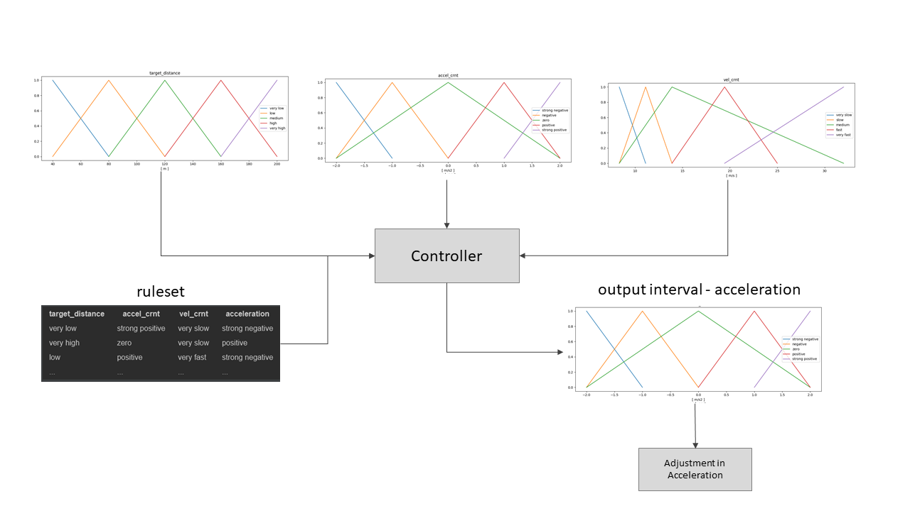

# Fuzzy-Controller
The purpose of this repository was to create a working fuzzy-controller from scratch in order to understand how it works, to encounter it's limitations and also to understand what kind of mechanics must or can be used, and in which areas a creator can have some freedom while implementing the algorithm. The controller is written in a generic format and not limited to the validation use case described below. It could be used for a wide range of other use cases as well without additional modifications on the controller itself.


## How use the Controller for your own experiment
#### Dependencies
The project includes a Pipefile with all dependencies required as well as a requirements.txt. The project was written in python 3.7 so make sure you use at least 3.7.*. Libraries used for this project:

- numpy
- matplotlib
- pandas
- scipy
- shapely

#### Useage

If you want to use the controller for your own project this would be the structure you should follow:
```
# import project related modules
from experiment.intervals import accel, settings
from components.vehicle.bidirectional import SimpleCar
from components.controller.fuzzy import FuzzyDistanceController


# define the fuzzy controller configuration
ruleset = pd.read_csv("/path/to/your/ruleset.csv", sep=";")
print(ruleset.head())


# define settings / parameters used for your project
# one parameter includes multiple subgroups / members - for inspiration check the experiment architecture
parameter1 = {
    "very small": {"lower_end": value of lower end, "center": value of center, "upper_end": value of upper end},
    "small": {"lower_end": value of lower end, "center": value of center, "upper_end": value of upper end},
    "medium": {"lower_end": value of lower end, "center": value of center, "upper_end": value of upper end},
    "big": {"lower_end": value of lower end, "center": value of center, "upper_end": value of upper end},
    "bigger": {"lower_end": value of lower end, "center": value of center, "upper_end": value of upper end}
}

output = {
    "very small": {"lower_end": value of lower end, "center": value of center, "upper_end": value of upper end},
    "small": { ...
}

# input can also have multiple parameters 
settings = {
    "name of parameter1": [parameter1, "[ unit of measure]"],
    "name of parameter n": [parameter_n, "[ unit of measure]"],
}

# set fuzzy controller which will be used by the following car
fc = FuzzyDistanceController()
fc.set_inputs(settings)
fc.set_ruleset(ruleset)
fc.set_output(output, "name_of_output")

fc.show_members()
fc.run(
    {
        "name of parameter1": value
    }
)
```


## Validation Use Case - Distance Controller


For validation the famous use case of autonomous driving was utilized. Therefore the fuzzy-controller is used to adjust the speed of a following car in order to keep distance to a leading car and to avoid a crash but allow the car to accelerate when it's save to accelerate. The files for the specific experiment can be found the the folder "*experiment*", while the files and the code for the generic fuzzy-controller can be found in "*components/controller*". The main file for the experiment is "*experiment/simple_car_travel.py*".


#### Framework

##### Premises for this experiment
To concentrate only on the functionality of the fuzzy-controller the following premises do define the overall experiment situation.

- The cars can only move in one direction which is forward. Therefore speed and velocity share the same meaning.
- only two cars do drive on one road and other objects or events can be ignored.
- The leading vehicle follows a pre defined list of milestones defined by velocity over a certain time (in seconds) and only the following vehicle does use the fuzzy-controller.
- The distance to the leading vehicle is known or handed over to the following vehicle. It is assumed, that the controller would get this value in a real world example from a car internal radar or laser system.
- the cars do use only simple physics and the distance is measured by the center from one car to another because dimensions like weight, width and height are ignored.

##### Parameters and Intervals
For this fuzzy-distance-controller experiment three input parameter are used. the specific values and structures can be found in "*experiment/intervals.py*"
- the current velocity of the vehicle using the controller in meter per second [m/s]
- the current acceleration of the vehicle measured in meter per second squared [m/s²]
- the distance to the leading car measured in absolute meters [m]


##### Ruleset
The rule set was crafted by the author and is defined by the three parameters described above. The resulting action of the controller is a relative increase or decrease in acceleration for the car using the controller.
The full table can be found in "*experiment/test_rules.csv*" but here is a short example:

| target_distance        | accel_crnt           | vel_crnt  | acceleration   |
| -------------          |:-------------        | :-----    |:------         |
| very low               | strong positive      | very slow | strong negative|
| very high              | zero                 | very slow | positive       |
| low                    | positive             | very fast | strong negative|
| ...                    | ...                  | ...       | ...            |


##### Architecture
The following architecture results from the parameters, intervals and ruleset defined above:


##### Duration and Milestones
The experiment is set for a theoretical duration of 60 seconds (1 Minute) and the leading car is changing it's velocity in a unregular way in order to test the reaction of the controller.

#### Results


The experiment shows that the controller works quite well within the defined framework and experiment. The following car (orange) does roughly adapt the behavior of the leading car (blue) and breaks in case the distance between the cars is too low. Therefore the experiment and the purpose of the project are full filled. The fuzzy controller itself works quite well and the experiment was a success as well.

#### Limitations and Further Improvements 

###### Experiment
The experiment is mainly used to verify the functionality of the controller itself. The use case is not quite new and was designed and archived multiple times before. In order to gain the most experience from the project no previous blueprint or already known solution was taken into account. This might mean, that the solution resulting from this experiment might be not as good as other solutions. However, with modifications on the definitions of intervals or the ruleset itself major improvements can be archived.


###### Controller
The controller works well for simple scenarios like this one. However, the controller itself is still quite simple and is probably not able to handle each possible edge case. A limitation could also be, that the controller uses the centroid of gravity for a resulting polygon in order to define the absolute output value of one membership (strong negative, negative, zero and so on). This might not be the perfect solution but works at least in the experiment quite well. 